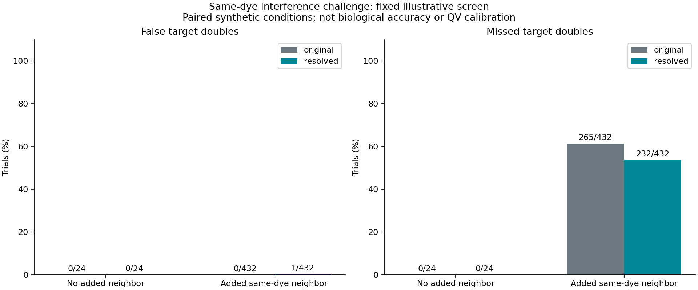
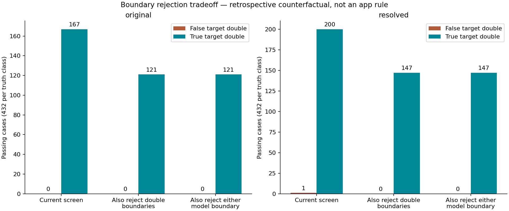

# Peak Tracer v2.0 — current state and next development plan

Updated 16 September 2026. **Open development, not locked or packaged.** Branch:
`dev-peak-tracer`. Baseline implementation commit: `4862ae1`. The September 16 step-3 neighbor
challenge below records the latest experiment; production code is unchanged. Package version: `2.0.0-dev`.

This is the single active v2.0 working document beside the task wiki, mirrored in
repository `docs/v2.0/CURRENT_STATE.md`. It replaces the four previous standalone
plan/results/next-steps/native-evidence documents as the current guide. Their
original copies remain archived for provenance; superseded integration commands,
claims and implementation plans are intentionally excluded here.

## Current decision

Continue native signal modeling and evidence diagnostics. Keep v1.9 resolution
and inherited Seq7 QVs as the active output behavior. No calibrated native scorer
or replacement basecaller has been demonstrated. Do not lock v2.0 as a QV or
read-length improvement at this point. The September 16 checkpoint adds diagnostic metadata only; model fitting and
exported signal processing are unchanged.

## Chronology relevant to today's code

| Stage | Recorded change | Present consequence |
| --- | --- | --- |
| September 9–10, early v2.0 experiment | An external quality-estimation engine was evaluated and optionally integrated. | That integration was later removed; its numerical changes are not current app results or proof of calibrated improvement. |
| September 15, `ab2cd00` | Removed TraceTuner integration at the user's request. | No runtime adapter, scoring CLI mode, GUI integration or bundled engine is part of the active app. Historical experimental files remain stored. |
| September 15, `d6c9da4` | Added optional native signal diagnostics and continuous local one/two-peak fits. | Current scientific implementation; diagnostics do not change calls, QVs or trace output. |
| September 15, `9b4209d` | Recorded synthetic challenges, two-plate audit and figures. | Evidence supporting the current diagnostic milestone, including its limitations. |
| September 16, `45757c8`, `9810e46`, `20b1463` | Preserved experiment lookups after v1.7–v1.9 wiki consolidation and resource relocation. | Maintenance only; production processor source and scientific outputs unchanged. |

The old engine's age alone did not establish unreliability. The relevant decision
was that the user did not want it in the app and its reassigned scores had not
established independently calibrated accuracy on our processed signals. Detailed
superseded engine plans and usage instructions are not part of the forward plan.

## Current runtime, data and evidence locations

All paths below are relative to the task folder containing `task_progress.html`:

| Resource | Current location |
| --- | --- |
| Active working document | `Peak_Tracer_v2.0_Current_State.md` |
| v2.0 HTML wiki | `docs/v2.0/00_start.html` |
| Existing Python runtime | `shared_resources/packaged_v1.6/runtime/Scripts/python.exe` |
| Original input / PT comparator plates | `shared_resources/samples/sample4/` and `sample5/` (use their 2- and 3- folders) |
| Frozen v1.8 outputs | `docs/v1.8/evidence/sample4/5-v1.8` and corresponding sample5 folder |
| Frozen v1.9 outputs | `docs/v1.9/evidence/sample4/6-v1.9` and corresponding sample5 folder |
| Current native-evidence output | `v2.0_validation/native_evidence/sample4/9-v2.0-native-evidence-refined` and corresponding sample5 folder |
| Native-evidence numbers and figures | `v2.0_validation/native_evidence/results` |

The original absolute paths in historical manifests remain unchanged. Experiment
lookup helpers resolve the relocated resources. Reproduction uses the existing
runtime and current scripts, not the removed engine mode. Old `7-` engine outputs
and preliminary `8-` grid-only diagnostics remain historical files; use `9-`
for the current native evidence. Nothing in `v2.0_validation` is removed or moved
by this consolidation.

## Outcome and scope

The app now has an optional native signal-evidence diagnostic path. It compares
original and resolved traces, measures sensitivity to processing strength, and
fits competing one-peak/two-peak explanations for isolated same-base pairs.
It does **not** assign new QVs, insert/delete calls, or change resolution behavior.
The default app still uses v1.9 resolution and inherited Seq7 qualities.
This is implemented app code, not just an external plotting experiment, but is
currently exposed only through the CLI `--write-evidence` option.

The scientific result is a useful diagnostic foundation, not proof that we can
replace PeakTrace's caller or quality model. No new biological accuracy claim is
made. TraceTuner is not a dependency and has not been reintroduced.

## Active plan and implementation status

| Documented step | Status in this increment |
| --- | --- |
| Per-base native evidence | Implemented competing-dye ratio, local spacing ratio, crest offset, local high-frequency residual proxy and strength sensitivity. Repeat valley contrast and fit residuals are available for modeled pairs. There is no independent fit residual for every base. |
| Synthetic and real-window investigation | Implemented seeded synthetic experiments, a second harder parameter challenge, and diagnostics for both real plates. |
| Competing local hypotheses | Implemented one-versus-two Gaussian fits for isolated double repeats, on original and resolved analyzed signal separately. Longer runs, alternative-dye model fitting and raw-channel forward modeling remain open. |
| Published-method quality calibration | Not implemented. Measurements are not error probabilities. Independent confirmed outcomes and held-out calibration data are still needed. |
| Correct recovery / error-rate evaluation | Synthetic one-versus-two truth is tested. Real biological substitutions, indels and confident-error rates are not established by these samples. PT agreement is not substituted for truth. |

## Diagnostic definitions and boundaries

`peaktrace/evidence.py` subtracts a slow fifth-percentile baseline separately from
each analyzed dye. Per-base features use the **source** call positions and dye
order (`FWO_1`), before any output masking or duplicate-position removal. Both
original and resolved features use that same coordinate system. Index fields are
zero-based source indices; plots also show human-readable one-based call numbers.
Evidence describes floating-point processing channels before AB1 display scaling
and integer serialization. Small plotted differences can arise from quantization.

The competing-dye ratio is the strongest other-dye maximum divided by the called
dye maximum in a local quarter-spacing window. Noise fraction uses a robust
residual from a seven-sample quadratic smoother, divided by the called height.
It is a **shape-sensitive noise proxy**: sharpening itself can change it. Neither
ratio is a posterior error probability. Missing/zero-signal features are null,
not a fabricated quality. Ambiguous calls and neighborhoods with duplicate
positions are explicitly unavailable.

Stability compares the chosen strength with strength minus/plus 0.05, clipped to
the allowed range. At the current default this means 0.75 and 0.85 around 0.80.
It records crest movement, competing-dye ratio changes and dominant-dye switches.
This measures local parameter sensitivity, not reproducibility across instruments
or chemistry. Short reads and disabled resolution do not fabricate a stability
measurement. Extra resolver runs and local feature calculations add runtime.

For an isolated pair, a three-spacing window is fit with one Gaussian or two
Gaussians sharing width but having separate nonnegative amplitudes and bounded
centers. A coarse grid initializes bounded continuous least-squares refinement
of **both** model families. Width bounds are 0.20–1.10 base spacings. The one-peak
center can span -0.25–1.25; double centers lie within ±0.15 of the two source
anchors. The local fifth-percentile background is held fixed. Edge windows,
spacing outside 4–100 scans, flat signal and failed convergence are unavailable.
Width-boundary flags are recorded. The September 16 checkpoint additionally
records each model's convergence, solver status, evaluation count and named
amplitude/center/width boundaries. See the checkpoint below.

The reported delta is `n*log(SSE_one/SSE_two) - 2*log(n)`, with a numerical SSE
floor. It is a descriptive BIC-style comparison with two additional parameters,
**not** a calibrated significance, Bayes factor, or confidence probability.
Residuals are correlated; real peaks need not be Gaussian; bounded optimization
does not guarantee a global optimum. Neighbor contamination and a fixed baseline
can bias the result. Existing source anchors constrain the hypothesis: this is
not a de novo peak detector and cannot discover arbitrary missing calls.

Only exactly two adjacent identical source calls are modeled. AAA/AAAA and longer
runs are marked as needing a joint model. In particular, this increment does not
claim to fix the original long-A repeat issue. No reference or PT trace is used
to select calls or fit hypotheses.

## Tuning and deviations discovered during testing

The first implementation used the grid alone. In 216 synthetic trials, it falsely
favored two peaks in 17 of 54 symmetric single-peak cases, even after an
illustrative residual/amplitude screen. An off-grid single center/width fitted
poorly enough to give the more flexible double model an artificial advantage.

The correction was continuous bounded refinement of both families, initialized
by the grid. This removed those 17 false preferences on the same test. A targeted
off-grid single-peak regression test now protects this behavior. No QV threshold
was tuned to PT or real-plate labels. Initial grid-only real runs are preserved
as exploratory `8-v2.0-native-evidence` folders; use the final
`9-v2.0-native-evidence-refined` folders instead.

An illustrative screen was fixed before the continuous-fit correction:
delta > 10, double relative RMS < 0.15, and minor/major amplitude ratio > 0.15.
It exists in experiment scripts only. It does not drive app calls, QVs or QC.
Passing is a model-fit observation, not a biological QC pass. A stricter or looser
screen would give different counts.

## Synthetic results

Initial/final development sweep: four families × three widths × three noise
levels × six seeds = 216 trials. After refinement, both stages passed all 54 true
equal-width and all 54 true unequal-width pairs; neither passed any of the 108
single-peak cases. Zero-noise trials repeat across seeds and are not independent
replicates. This clean result prompted a tougher challenge, not deployment.

The second challenge uses new seeds 30–35, widths 0.25/0.38/0.52/0.72 spacings,
noise 1%/4%/12% of the main amplitude, a different single-peak center, stronger
asymmetry, a weaker second peak (35%), and a 2:1 width ratio in unequal pairs.
The screen and fitting code were not retuned after seeing its results.

| Synthetic truth | Trials | Original passes | Resolved passes |
| --- | ---: | ---: | ---: |
| Symmetric single | 72 | 0 | 0 |
| Asymmetric single | 72 | 0 | 0 |
| Equal-width double | 72 | 36 | 54 |
| Unequal-width double | 72 | 36 | 48 |

Resolution lets more true pairs pass in this selected synthetic family. It still
misses 18/72 equal-width and 24/72 unequal-width pairs. Zero observed false pairs
among 144 synthetic single cases is not evidence for Q30 or Q40 accuracy. The
challenge is a held-out parameter sweep, **not** a held-out biological plate.
It lacks many realistic failure modes: dye blobs, saturation, mobility artifacts,
mixed templates and correlated instrument noise. No scores are calibrated from it.

## Real-plate audit

All 146 reads completed: sample4 78/78, sample5 68/68, no skipped reads or errors.
Runs took 494 and 448 seconds respectively while running concurrently on this
laptop; these are not isolated performance benchmarks. The 109-test suite passed.

The independent BioPython audit verified source hashes against the earlier v1.9
provenance, plus exact equality with frozen v1.9 for PBAS/PCON/PLOC sets 1 and 2,
raw DATA1–4, analyzed DATA9–12, P1AM, clear-range tags and SEQ exports. The new
provenance tag differs, so whole AB1 files are not byte-identical. The processor
source hash for all final outputs is
`42f498dea02ebf6a4e7ba5d8a4868e8bcf481c47087e0ce46f7dcbad70653600`
(implementation commit `d6c9da4`).

| Plate | Native/v1.9 Q20 | PT Q20 | Native/v1.9 Q30 | PT Q30 |
| --- | ---: | ---: | ---: | ---: |
| sample4 | 70,268 | 88,736 | 62,874 | 82,221 |
| sample5 | 65,186 | 82,188 | 59,022 | 76,930 |

These counts remain unchanged by native evidence. They are predicted-quality
counts, not verified correctness or comparisons of mean Phred values.

The sidecars contain 172,534 source-call records and 44,889 adjacent same-base
pair records. Of those, 23,831 have successful fits in both stages; 21,054 have
no original fit (including deliberately excluded longer runs), and another four
have an original fit but no successful resolved fit. Consequently this analysis
does not cover all repeats.

At source calls 601–900, median competing-dye ratio changes from 0.236 to 0.077
for sample4 and 0.204 to 0.061 for sample5. This is substantial signal separation,
but the diagnostic itself is affected by resolution and must not be turned
directly into higher confidence. In that span, 6,183/6,362 modeled pairs pass the
screen on original traces and 6,221/6,362 on resolved traces: 54 additions and 16
losses, a net gain of only 38. Most isolated pairs already pass on the input.

Beyond call 900, there are 541 newly passing pairs and 552 lost passes, a net loss
of 11. Stability perturbations switch the dominant dye at 965 of 41,182 measured
tail calls (2.34%), versus 263 of 131,342 measured calls through 900 (0.20%).
These are sensitivity flags, not detected sequencing errors. Tail aggregation
is diagnostic only; no tail extension or improved usable read length is claimed.

Figures: [synthetic challenge](native-evidence/synthetic-challenge.png),
[real pair screen by read position](native-evidence/real-pair-screen.png), and
[real trace examples](native-evidence/real-pair-examples.png). Examples are the
largest valley gains within two explicitly selected categories among source
calls 101–900, not representative averages. “Supported” means passing the
illustrative original-signal screen; it does not mean independently confirmed.
The resolved-only example already has positive original delta but fails another
screen criterion. See [numerical audit](native-evidence/summary.json).

### Which folder to inspect

Under the task folder, final outputs are:

- `v2.0_validation/native_evidence/sample4/9-v2.0-native-evidence-refined`
- `v2.0_validation/native_evidence/sample5/9-v2.0-native-evidence-refined`
- `v2.0_validation/native_evidence/results` contains the numerical experiments,
  audit, logs and figures.

The AB1s are v1.9-equivalent; the new information is in `.evidence.json` files.
The neighboring `8-v2.0-native-evidence` directories are preliminary grid-only
diagnostics and are superseded. Historical `7-v2.0-experimental-qv` TraceTuner
outputs are also not outputs of the current app. No old output was overwritten.

## Reproduction and artifacts

From the project root, use a Python environment with the existing app requirements:

```powershell
python python-app/peaktrace_core.py --input-dir POST_SEQ7_FOLDER --output-dir FRESH_FOLDER --no-preprocess --write-evidence
python python-app/experiments/native_evidence_stress.py --output RESULTS/synthetic-refined.json
python python-app/experiments/native_evidence_stress.py --holdout --output RESULTS/synthetic-holdout.json
python python-app/experiments/summarize_native_evidence.py --task TASK_ROOT --output RESULTS
python python-app/experiments/plot_native_evidence.py --results RESULTS
python -m unittest discover -s python-app/tests
```

The real-plate summary script resolves the former v1.7/v1.8/v1.9 paths to their current archive locations and
asserts file counts, source SHA-256, exported array/SEQ equality against frozen
v1.9, and a single processor source hash. Plotting additionally needs matplotlib.
The tested processing interpreter was the existing packaged-v1.6 Python 3.11
runtime; plotting uses the laptop's Python environment. No engine is downloaded.

Each JSON sidecar contains provenance, summary, per-base rows and repeat-pair rows.
The run manifest links its sidecars and summaries. Existing sidecars are protected
by batch collision checks. Serialization rejects nonfinite JSON values, and
diagnostic failures occur before promoting that read's AB1/SEQ outputs.

## Calibration data and published grounding

The supplied sample4/sample5 ZIP inventories contain AB1/SEQ (sample4 also SCF and
`.1` records); they do not contain returned SQD/PDF alignments or an explicit
independent truth-label dataset. The intended design sequence alone would not
prove what a sample actually contains. Other independent records can be added
later; their absence here is not a claim that the company has no such records.

Published grounding: [Phred II](https://doi.org/10.1101/gr.8.3.186) estimates errors
from trace parameters and validates probabilities; [LifeTrace](https://doi.org/10.1101/gr.177901)
distinguishes call quality from gap quality. These motivate empirical calibration
and separate indel evidence. This implementation is an original diagnostic
prototype, not a reproduction of either published caller or its calibration.

No build, packaging, lock, squash, push or claim of PeakTrace replacement is part
of this increment.

## Next experiment: executable development sequence

The broader tasks below remain proposed, except for the small diagnostic
checkpoint explicitly recorded here. Continue adding v2.0-labelled
commits on the development branch; leave lock, squash, build and packaging for a
separate user decision.

1. **Audit fit failure and contamination first.** Extend `peaktrace/evidence.py`
   with explicit residual/neighbor, saturation, baseline and width-boundary flags.
   Preserve an unavailable/ambiguous outcome rather than forcing a hypothesis.
   Extend `native_evidence_stress.py` with correlated noise, neighboring same-dye
   peaks, skewed widths, saturation and baseline drift. Freeze the original
   challenge as a regression set and use new seeds/conditions for evaluation.
   Gate: report both false double preferences and missed true doubles; a deeper
   valley or more passing fits is insufficient. Keep AB1 output unchanged.
2. **Prototype joint three/four-base repeat hypotheses.** Compare plausible peak
   counts using original analyzed signal, local spacing and bounded nonnegative
   components. Include neighboring contributions and penalize extra flexibility.
   Test unequal widths and imperfect anchors. Start with synthetic truth and the
   exact POS1 / U0827P1A8-F1 B01 issue windows, then apply unchanged settings to
   both plates. Gate: holdout repeat-count recovery and false-splitting evidence;
   do not select counts by matching the intended construct. Keep this diagnostic
   until biological validation supports changing calls.
3. **Only then compare alternative-dye and raw-signal models.** Use the existing
   v1.9 raw mapping as a candidate correspondence with its rejection gates and
   no extrapolation. Validate dye identities and repeat ambiguity separately.
   Passing interpolation checks alone is not permission to revise a base.
4. **Prepare independent labels in parallel when records become available.**
   Collect reviewer-confirmed sequence and read/primer mappings, including true
   variants, failures, ambiguous regions and mixtures. Freeze plate/construct
   splits before model selection. Passed-only returned ZIPs would omit important
   failure cases. An intended reference or PT output is not sufficient truth.
5. **Choose and calibrate a native scorer after features and labels are credible.**
   Compare empirical feature-to-error estimators grounded in published methods.
   No specific estimator or table is selected yet. Evaluate substitution and
   indel/gap uncertainty separately, with reliability plots, confident-error
   counts and correct usable sequence on untouched biological holdouts. Gate:
   demonstrated calibration and improved outcomes before writing new PCON values.

### Small-step execution checklist and restart point — September 16

1. **Done: review baseline and save this checklist.** Baseline `0967a8c` already
   rejected non-converged fits and recorded a combined width-boundary flag.
2. **Done: expose optimizer constraints and failures.** Each attempted model now
   records `fit_diagnostics`: convergence, numeric SciPy termination status,
   evaluation count and named lower/upper parameter bounds. `diagnostic_flags`
   identifies model-specific bounds or non-convergence. Solver-active bounds or
   absolute distance below 1e-4 in normalized amplitude/base-spacing units are
   reported. This retains the existing width-boundary tolerance. Non-converged
   comparisons remain unavailable and do not receive a model-preference score.
   Boundary-constrained fits remain available with flags: reaching a bound does
   not establish a false fit, and an interior fit does not establish correctness.
   Bounds, optimizer settings, numerical scores and existing screen are unchanged.
3. **Done: neighboring same-dye peak interference (see results below).** Add a separate seeded
   synthetic challenge with known single/double truth and controlled neighbor
   distance/amplitude. Report false splitting and missed pairs, with boundary
   flags stratified by model. Preserve the original challenge as a regression set.
   Do not adopt a rejection threshold merely because it increases passing pairs.
4. **Pending: baseline drift and saturation.** Add these as separate experiments;
   introduce rejection rules only when measured failure cases support them.
5. **Pending: real-window audit, then both plates if warranted.** Start with the
   original issue reads. Use a fresh output folder; retain the old `9-` outputs.
6. **Ongoing: synchronize this guide and wiki at every checkpoint.** Record tests,
   source hashes, limitations and the next uncompleted step before stopping.

Validation for checkpoint 2: **9 evidence tests and all 113 suite tests passed**
using the existing packaged Python runtime. Four new tests cover narrow peaks
hitting minimum width, displaced peaks hitting center bounds, an interior double,
and forced evaluation-budget exhaustion without a fabricated comparison score.
The existing CLI test verifies evidence mode preserves biological arrays and SEQ
output on its fixture. No new full-plate run was performed at this checkpoint;
the 146-read figures and source hash above describe the prior implementation.
This is diagnostic observability, not an additional resolution or QV improvement.

Checkpoint processor source SHA-256: `7bacef458401d72fc44fe4755e5500f082aee9eff6398b0410e1a6e40d43ad33`.

The evidence schema name remains v1 with additive fields. Early unavailable
windows (edge, zero signal or unsupported spacing) never run the solver and have
no fit diagnostics. Consumers must tolerate absent diagnostics and unknown fields.

### Step 3 completed — same-dye neighbor interference, September 16

Experiment scripts: `python-app/experiments/neighbor_interference.py` and
`plot_neighbor_interference.py`. No production processing or fit thresholds changed.

The fixed design has 48 controls and 864 added-neighbor cases: target single or
double, widths 0.30/0.45/0.60 spacings, Gaussian noise 2%/8%, seeds 60–63,
left/right neighbors at 0.5/1.0/1.5 spacings outside the nearest target anchor,
neighbor amplitudes 25%/75%/150% and width 0.4 spacing. The single target is at
0.44 spacing; true doubles have amplitude ratio 0.65. Both stages use the app’s
slow baseline subtraction before local fitting. The original screen is unchanged.

The source double anchors are deliberately retained for single-target truth.
An outside neighbor is nuisance signal, not a second target base. This tests
misattribution within the fixed fitting window, not de novo calling. A close
neighbor may be a real extra component in that window; the error is interpreting
it as evidence for two target calls. Added signal can overlap existing synthetic
context. The generated trace is a stress fixture, not a complete biological model.

| Condition | Stage | False target doubles | Missed target doubles | Unavailable (single / double) |
| --- | --- | ---: | ---: | ---: |
| No added neighbor | original | 0/24 | 0/24 | 0 / 0 |
| No added neighbor | resolved | 0/24 | 0/24 | 0 / 0 |
| Added neighbor | original | 0/432 | 265/432 | 0 / 0 |
| Added neighbor | resolved | 1/432 | 232/432 | 6 / 1 |

Missed doubles include unavailable comparisons; no unavailable fit is treated
as a pass. Paired conditions reuse controls and noise, so these are descriptive
counts, not independent samples or biological error-rate estimates.

| Added-neighbor screen | Stage | False target doubles retained | True target doubles retained |
| --- | --- | ---: | ---: |
| Current screen | original | 0/432 | 167/432 |
| Reject double-model bounds | original | 0/432 | 121/432 |
| Reject either-model bounds | original | 0/432 | 121/432 |
| Current screen | resolved | 1/432 | 200/432 |
| Reject double-model bounds | resolved | 0/432 | 147/432 |
| Reject either-model bounds | resolved | 0/432 | 147/432 |

Interpretation: neighbor contamination raises missed-double counts from zero in
these controls to 265/432 (61.3%) on original signals and 232/432 (53.7%) after
resolution. The resolved screen retains 33 more true pairs in aggregate, but also
admits one false target double (1/432, 0.23%). These percentages describe this
selected synthetic grid, not expected clinical or sequencing error rates.
Rejecting double-model bounds removes that one false result but also removes
53/200 passing true doubles (26.5%). There is no demonstrated basis here for
turning boundary flags into a blanket rejection rule.

The false target-double fixture is single width 0.60, noise 8%, seed 61, right
neighbor at 0.5 spacing with amplitude 25%. Its delta rises from 3.22 to 19.89;
the left double center reaches its upper bound in both stages. The old combined
width flag is false: the new center flag exposes a limitation it did not capture.
This is a saved failure case for future context modeling, not a tuned exclusion.

These boundary exclusions are retrospective counterfactuals, **not adopted app
rules**. A single-model bound can occur because the true signal is a double;
rejecting it can discard legitimate pairs. The JSON additionally stratifies
flagged/unflagged fits separately for each model and every distance/amplitude/side.




[Full summary](neighbor-interference/summary.json) · [All trials, compressed JSON](neighbor-interference/trials.json.gz)

Validation: **115 tests passed**. The prior 288-trial held-out challenge was rerun;
all pre-existing fields exactly match the frozen result after excluding the new
additive diagnostics. The original challenge and old plate outputs were preserved.
No real-plate reprocessing, call/QV changes or new quality claim is part of step 3.

Reproduce with the existing processing runtime:

```powershell
python python-app/experiments/neighbor_interference.py --output FRESH_RESULTS
python python-app/experiments/plot_neighbor_interference.py --results FRESH_RESULTS
```

The plotter needs matplotlib. The experiment refuses an existing output directory.
Its summary records the processor and experiment source hashes. Current processor
hash remains the step-2 hash; the experiment is outside production code.

**Restart at step 4:** add baseline-drift and saturation challenges separately.
Use the neighbor results when designing explicit context/residual rejection,
but do not tune and validate a new rule on the same cases. Joint neighbor modeling
remains a candidate investigation before any change to biological calls.

Near-term deliverable: a more discriminating diagnostic model and recorded failure
cases, not an automatic QV increase. Independent data constrains calibration; it
does not prevent the first two signal-model experiments from proceeding.

## Documentation maintenance

Keep this document and the v2.0 wiki aligned with subsequent implemented commits.
Record a new source hash and fresh output directory for scientific changes;
distinguish proposed experiments from implemented behavior. Keep the current
`9-` outputs and historical experiments intact as comparisons. The four old
task-root Markdown files are archived under `docs/v2.0/history`, not deleted.
Repository historical documents remain available but are superseded as the active
guide. The export helper now writes only this consolidated working document.
